METRO Annual Meeting -- 2013
=========

Cultural Source Code
---

This afternoon I gave a talk, <a href="http://github.com/micahwalter/mcn2012">similar to the talk</a> <a href="http://aaronland.info">Aaron</a> and I gave at <a href="http://mcn.edu">MCN</a> last year. This one however was for the <a href="http://metro.org/articles/meeting-schedule-and-agenda/">METRO Annual Meeting</a>. Below are the slides and notes. It was fun!

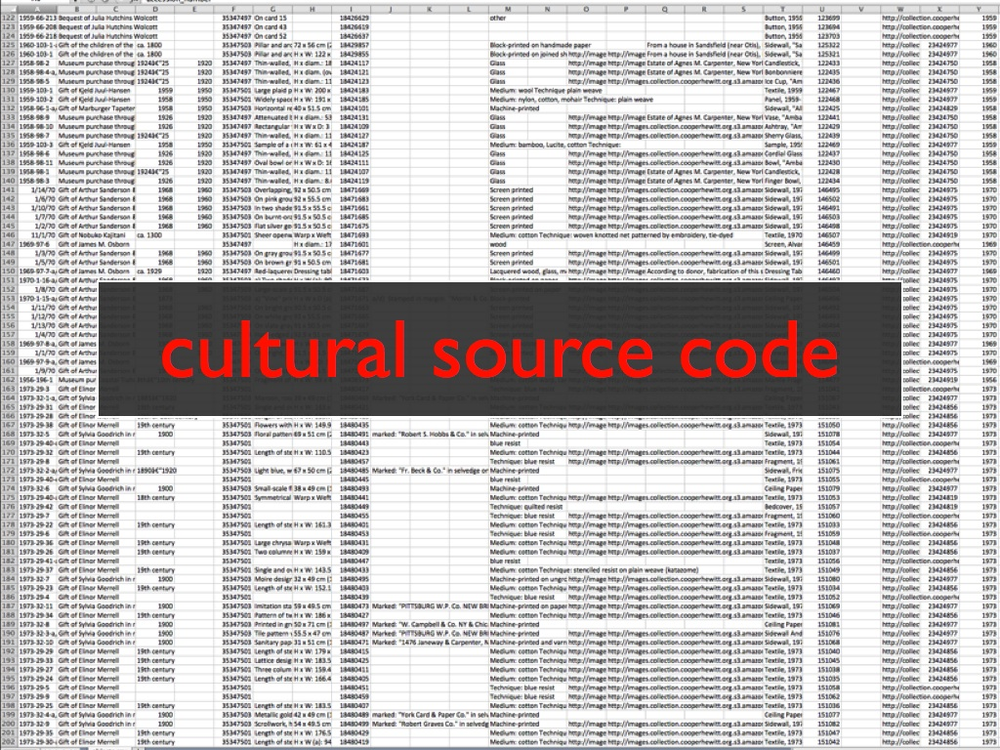

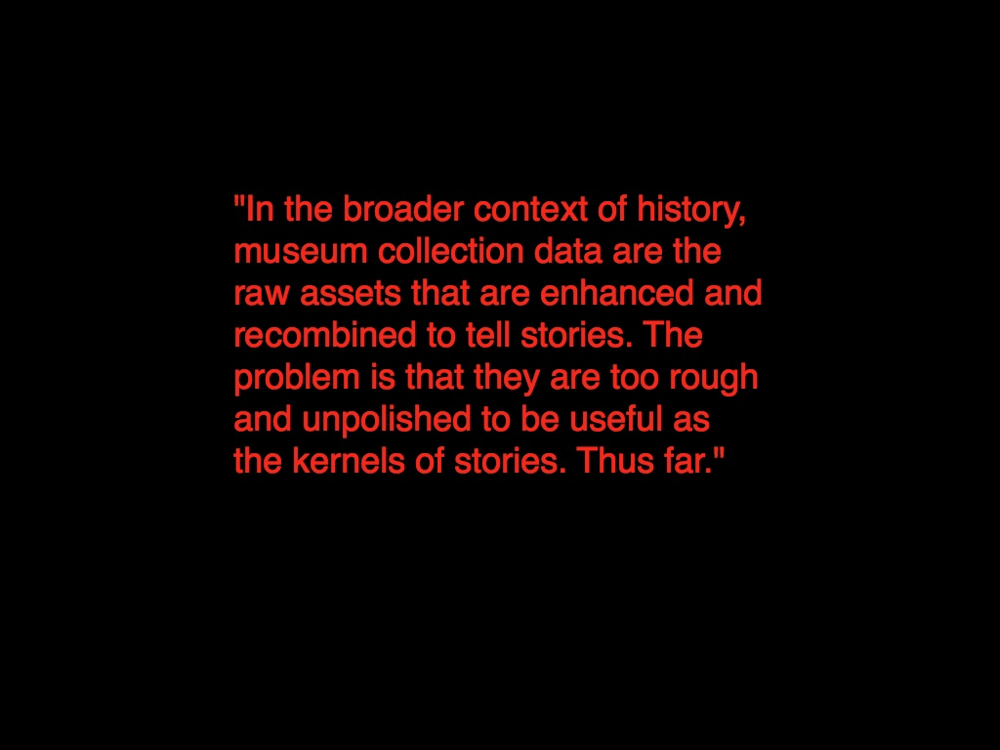

I'll begin with a quote from my boss, Seb Chan on what we mean by "cultural source code."

>"In the broader context of history, museum collection data are the raw assets that are enhanced and recombined to tell stories. The problem is that they are too rough and unpolished to be useful as the kernels of stories. Thus far."

This talk is going to be about two things.. our idea of cultural source code, and the concept of building momentum.

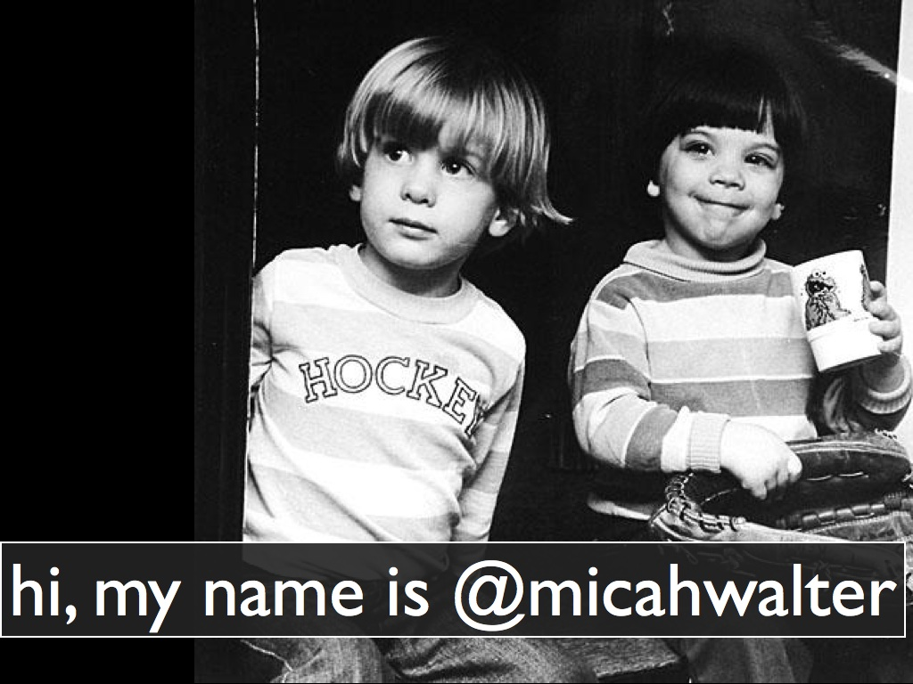

Hi, my name is Micah Walter, and I’m part of the Digital & Emerging Media team lead by Seb Chan at the Smithsonian’s Cooper-Hewitt, National Design Museum, here in Manhattan. Our museum is currently undergoing a "re-deisgn" in which we will completely renovate/restore/rethink our physical space on 91st street. This is an interesting time as we have a great opportunity to not only rethink what the physical museum will be in 2014, when we re-open, but also to rethink how our entire digital infrastructure might be.

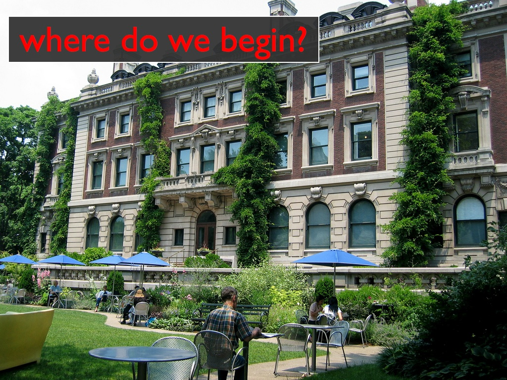

So we began this process of rethinking digital at the Cooper-Hewitt a little over a year ago. When Seb joined our staff as the Director of Digital & Emerging Media, he and I sat down over a cup of coffee to discus what needed to be fixed right away, but also we talked about where we would like to see things go, and how we might get there. We talked about a lot of ideas that day. We talked about upgrading Drupal so that our staff could become more savvy with the system, we talked about a better integration of our internal systems, and getting rid of the many "enterprise" solutions that just seemed to big and complex for our purposes, and then eventually we got to the topic of our collection data.

Cooper-Hewitt, at that time, had around 217,000 objects in its collection. Of those, about 10,000 were available to the public online. We discussed why this was and agreed that we needed to figure out a way to increase this number by an order of magnitude. To do this, we realized that we needed to reduce the minimum criteria for what we considered "ready for web." We needed to reduce this criteria as much as possible. We made suggestions on this topic, the curators threw up their arms, and there was a lot of yelling. But we were persistent, and eventually we came to an agreement that meant that we would have about 110,000 object "records" available online.

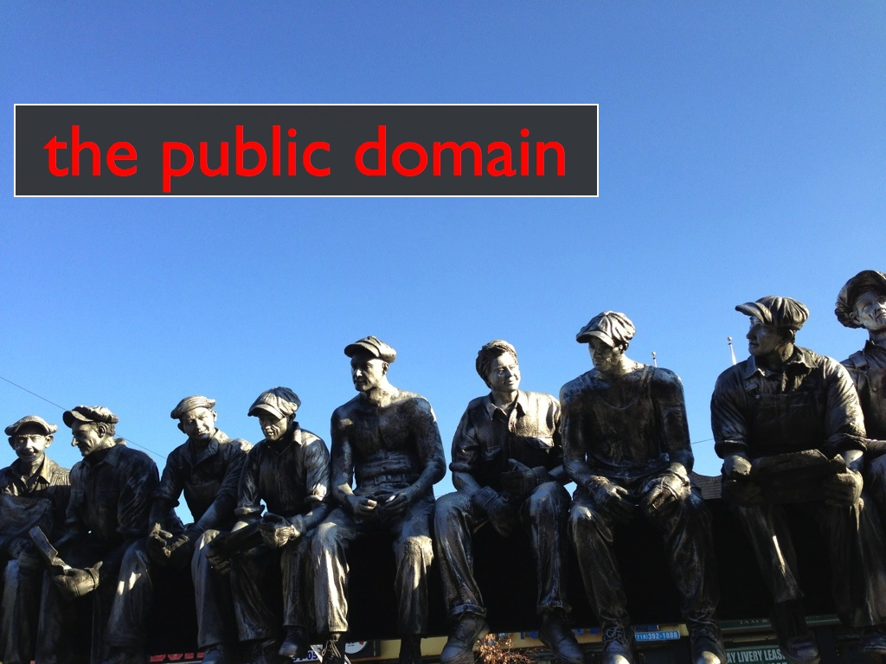

Our next idea, to get back to the concept of gaining momentum was to release our metadata. We talked at length about what that actually meant, but eventually we decided that in order to keep the ball rolling, and gain a little attention we would need to push to release our collection metadata as a CC0 CSV dump. We did this for a couple of reasons. The first reason was that the idea of "public domain" within the US government doesn't always apply outside of the United States. CC0 offered us a way around this so that we could essentially be offering a public domain data-dump to the entire world. The second reason was that we knew that it would set a precedent within the Smithsonian. Up until our initial data release, the Smithsonian had never done something like this. Many of us didn't quite understand what it meant to license the meta-data as CC0, and we knew we had to take baby steps if we wanted to continue to move in the direction we were interested in, so releasing this somewhat benign dataset seemed like a good first choice.

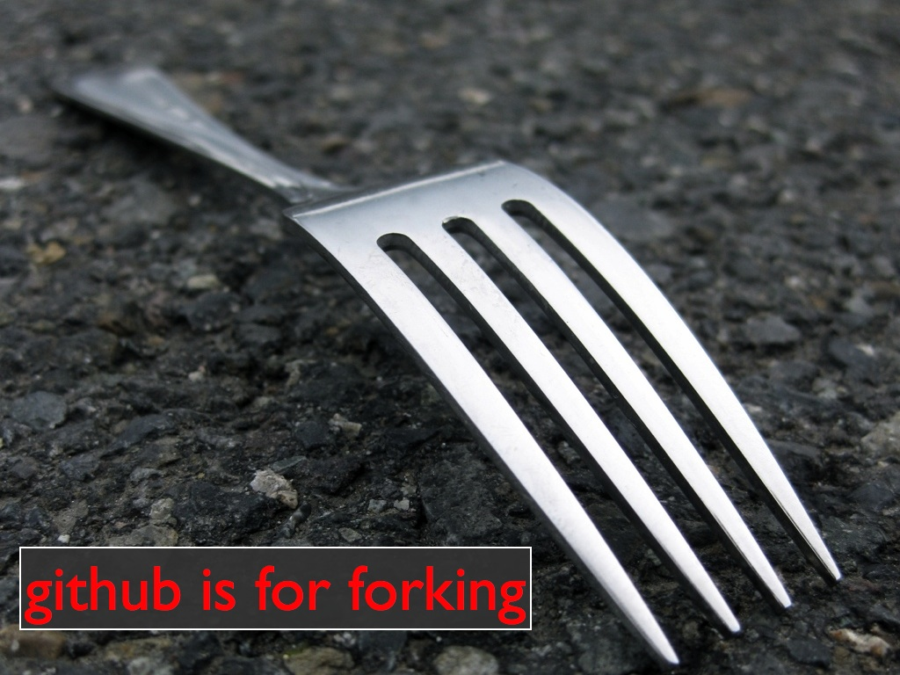

At some point we got to the point where we needed to actually put the data somewhere. We had gone through the approval process and were ready to go, but I had this idea of doing something a little more interesting than simply offering the data as a downloadable csv file. 

So, we turned to GitHub.com as a possible solution. GitHub was interesting as it had become a sort of social network for programmers. Developers post their open source code on GitHub and can "fork" and modify other user's code and contribute their own modifications and additions back to the original poster. This process of forking and merging sounded to me like it might apply to large data-sets as well. We could maintain a sense of authority, while allowing others to use our “cultural source code” and potentially even submit changes back to our main data-set. Through the tools provided to us via Git, we would be able to track a detailed version history over the life of the meta-data and would potentially be able to better understand how our meta-data changes over time as well as how the rest of the world might be able to contribute to our knowledge-base.
 
So we put the data up on GitHub and announced the CC0 license in February of 2012.

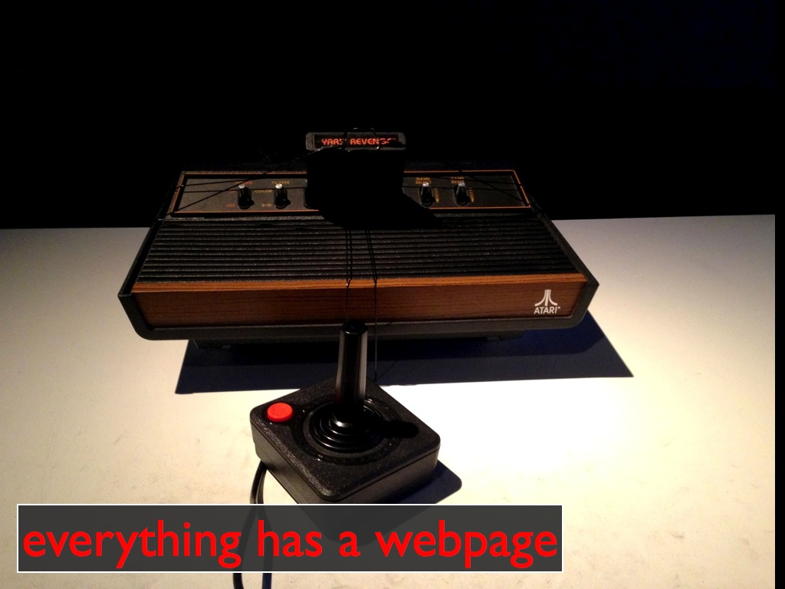

This caused a good amount of buzz in the museum and programmer communities. In fact, one developer by the name of Aaron Cope ( a former Flickr employee and now part of our team at Cooper-Hewitt ) took it upon himself to convert our repository of CSV files into individual JSON objects. This was an interesting exercise, because now you could have both the idea of a large downloadable data-dump as well as a sort of pre-made API where you could look up the meta-data for each individual object. And, as I’ll show you in a few minutes it automatically gives every first class object the idea of its own webpage.

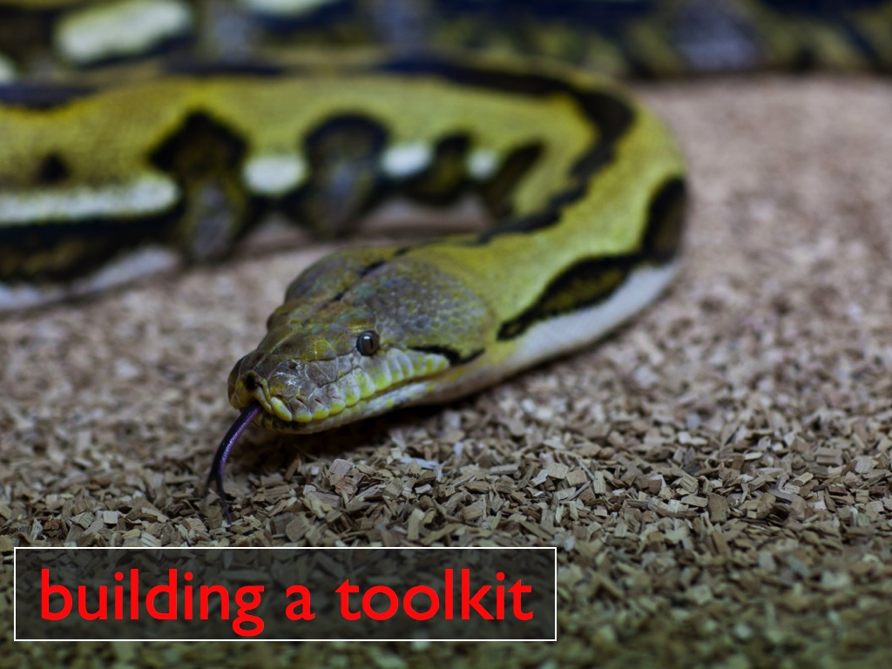

In the meantime, people have been using our data for all sorts of projects. We had our data used as example data at a THATCamp hack day in Virginia. Just last week I attended the Digital Humanities Winter Workshop where the class I attended on Linked Open Data used Cooper-Hewitt's GitHub repository as example data. Mia Ridge came to visit us and used our data to generate these visualizations of our collection, and Frankie Roberto used our data to build an app in one afternoon when he came to visit us last fall. In one afternoon he was able to build a little app that allows you to decide which object in our collection is a better representation of a design concept.

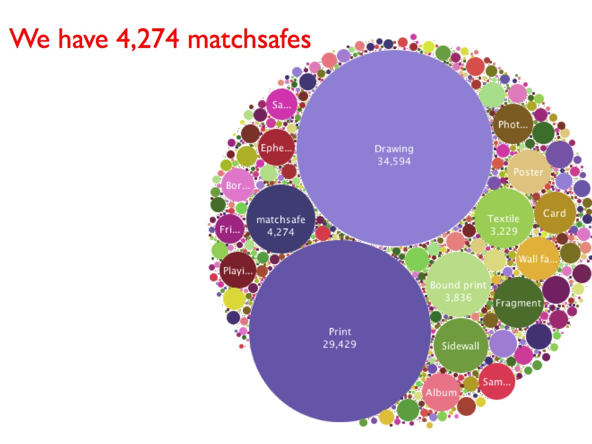

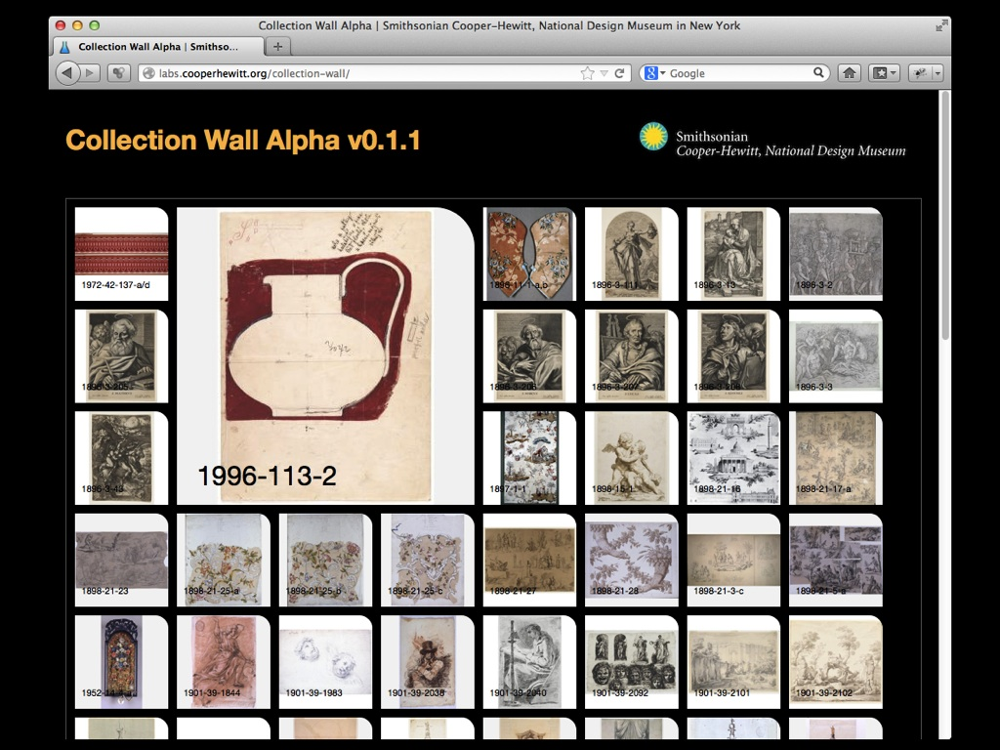

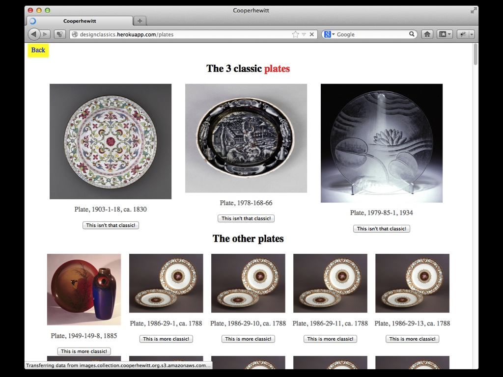

So very good, our data is out there, and people like it. What's next? Well, we decided at some point that we needed to use our own data and begin to build something very special for the museum. Up until recently we were displaying our collection online using an off the shelf product called eMuseum. It was a simple tool that allowed us to build a rudimentary, searchable website from our collection. It of course came with many obstacles and restrictions, and after a few years of struggling with it, we decided to throw eMuseum under the bus and start form scratch. We hired Aaron and tasked him and our growing team with the project of re-imagining our collections website, and in September of last year we released our first Alpha

The alpha gained a lot of attention. We wrote it from scratch. We tore down the normal ideology of what a collection website should be and began to build it from the ground up, making the things we thought we the most important front and center. So what were some of those things? 

( This is the part where I get all awkward and try to show you a short demo ) 

First, we wanted to begin figuring out a way to connect our data with already existing data sets. Some people called this "linked data" we just call it concordances. So we built out concordances with sites like Wikipedia, MOMA, Freebase and as you can see, many others. We don't have concordances for every person in our collection, and they may not all be accurate, but we know which ones are missing. We believed this linking of data was incredibly crucial and moving forward we wanted our collections site to center around the idea of what Aaron calls "being of the web" vs. "being on the web." So we continue to work on concordances.

We also wanted our website to be more approachable. We designed it with a minimalistic attitude and a somewhat whimsical style. You'll see small jokes here and there and the language is meant to be more engaging and less "institutional." We know that in order to be really relevant we need to disconnect ourselves from all of the institutional hand waving and move towards a website that anyone can enjoy and still gain some type of great benefit.

To do this we tried to make the site more browsable. I like to say "you can get lost on our website." It's a joy to browse around and discover things you would not normally discover if you were doing strict search based looking. To fulfill this browsing behavior we added a "random" button and when you go to the home page you get three random object presented on each page load. We also added a number of top level navigation and ways to browse from within the site. The idea being you never hit a dead end. Even if you were looking for something really specific, once you've found it, you can move ahead and continue to browse.

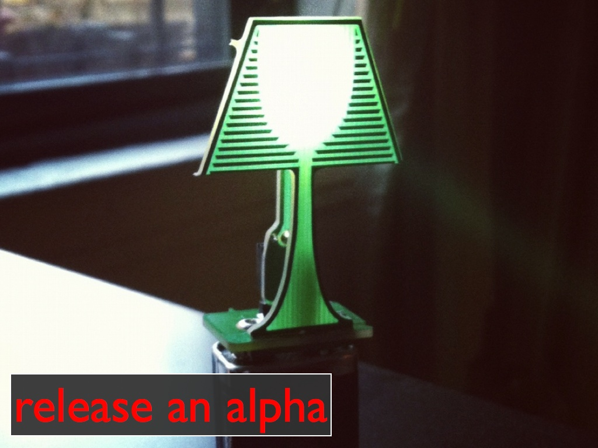

Another issue we tried to solve was that of identifiers. Our collection data comes from our collection management system called TMS, and that system creates ID numbers for all kinds of things. As well, all of our object records had accession numbers. We thought it might be useful to assign new numeric identifiers to every first class object. This includes people records, types, countries and so on. To do this in a way where we would avoid any possible collisions we chose to use a ticketing server. And to take things a little further, Aaron build a Ticketing server as a service called Brooklyn Integers. Yes, each of our object records have their own unique, hand crafted "artisinal" integer. Any of you can use Brooklyn Integers for your own projects, just remember, we have infinity in our side! But in all seriousness, this is actually very useful.

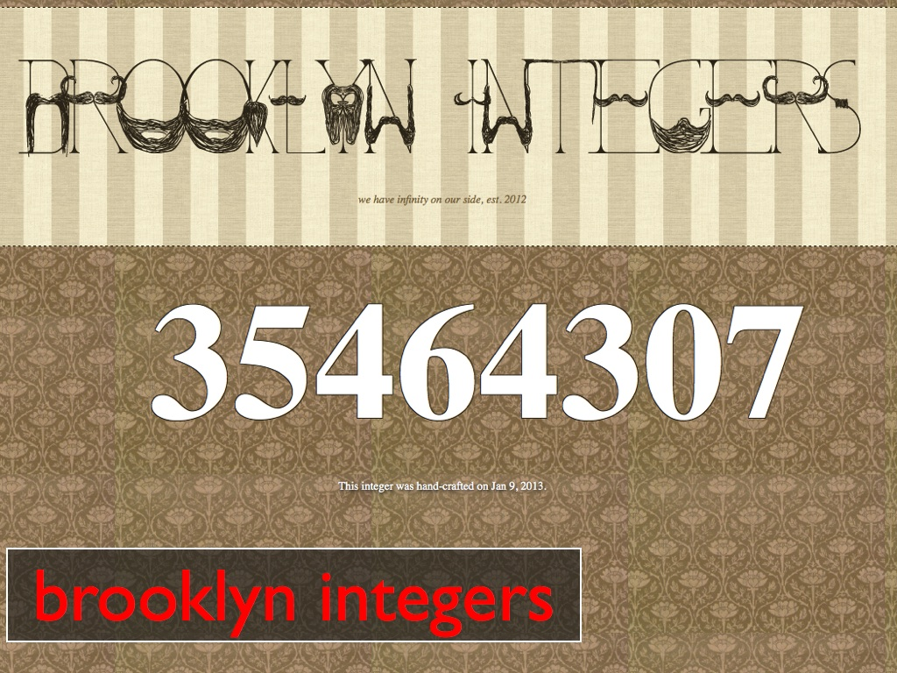

We recently released the compliment to our Alpha website, the alpha API. As you'll see, its very much an Alpha, and we don't guarantee that it will work properly for any length of time. But this brings us back to GitHub. We designed the API so that the responses you get are EXACTLY the same as the data provided in our GitHub repository. This is pretty cool when you stop to think about it. As a developer, you can just browse the GitHub data to get an idea of what a response "should" look like. This means you can rapidly prototype with our API and have a concrete thing to look at right along side. This also means, you don't always NEED to use the API, all of the data is right there without the requirement of any coding whatsoever.

But our API is still totally necessary. We built it on basic REST principals and we are using oAuth2, although somewhat reluctantly. So the whole argument of data-dump vs. API is kind of moot now. We offer the API, we offer the data dump AND we offer what the API would return anyway in a fully downloadable and forkable GitHub repository, complete with an infinite version history.

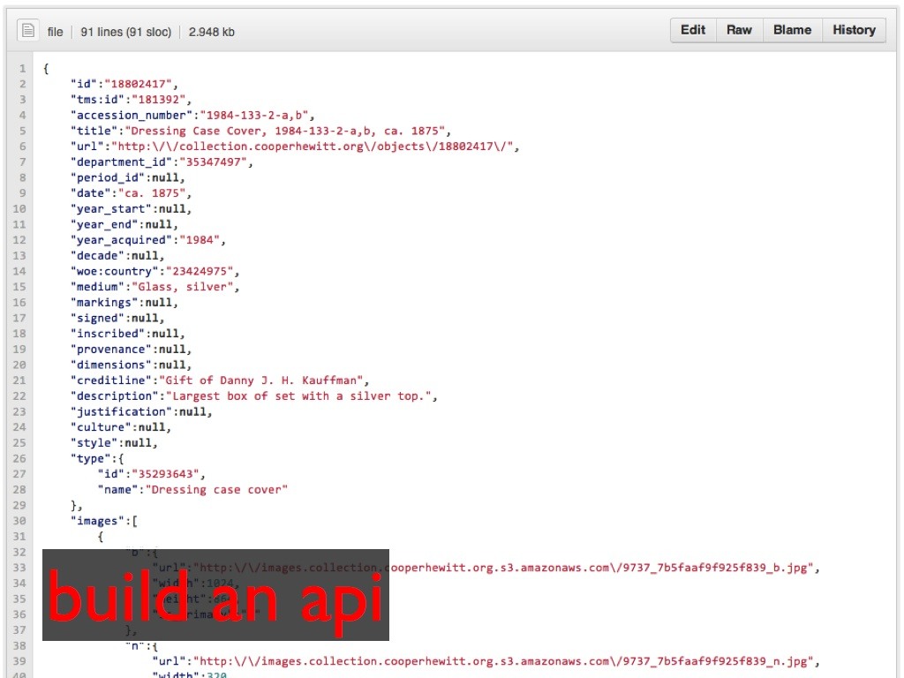

This is where we are now. We have a CC0 data-set available to the public. We have a new Alpha collection website, we have a public API. So whats next? Well, I can't tell you everything, but I can say, now that we are "up to par" with the rest of the world, we are working on making these things even better, and pushing the boundaries of what people normally think of when they think of a museum's collection data. We are working on automating the process of updating all of this meta-data on a daily basis ( just think of how one might visualize the change history to our GitHub repo after we've pushed auto-updates for a year or so. ) We are also aiming to connect our data with more and more existing data-sets. 

Just recently we published a list of our "known unknowns" and we hope that the Wikipedia community will take that list and begin creating articles for the designer WE know about. And we are working on simple ways to take the crowd sourced and community driven feedback and merging it back into our "source of truth and understanding" about our own collection. Our site has a simple feature right now where users can write feedback on any object. These messages get sent to our curators and registrar staff and they are able to verify changes and potentially update our database.

I really want to see us build this out further so that we can create a more succinct feedback loop. I believe that the world of knowledge surrounding design far exceeds what we could ever hope to bring to the table as a museum, and we should figure out a way to embrace that concept. There is certainly something to be said about the understanding the crowd has about something like a Roomba ( note the twitter feed ) which we will never be able to compete with. So why compete.

We are also opening back up in 2014, and our collection data will be front and center in the new museum experience. So our hope is that the tools we are developing here, and the momentum we are building, will inform that space and all of its inner-workings.

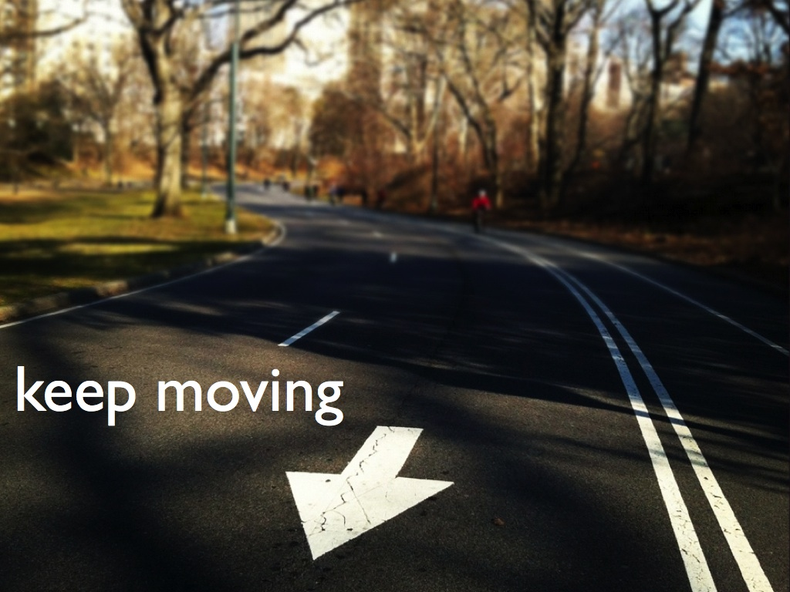
